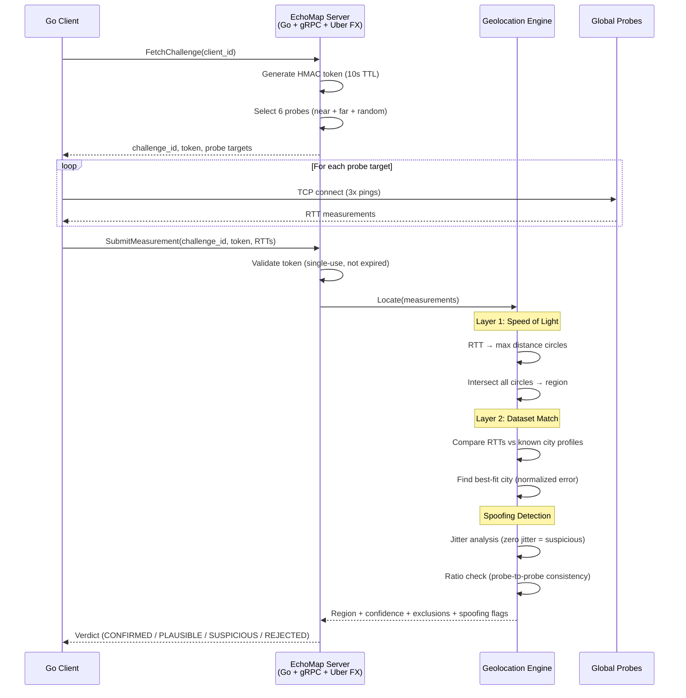
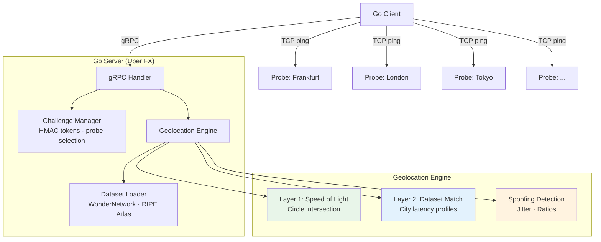

# EchoMap

**Latency-based geolocation using the speed of light as a hard constraint.**

EchoMap determines where a user physically is (and isn't) by measuring network round-trip times to globally distributed probes. It uses two layers of proof:

1. **Hard bound (physics):** Light in fiber travels ~200 km/ms. An RTT gives an absolute maximum distance from a probe. You can't fake being faster than light.
2. **Soft bound (datasets):** Known city-to-city latency data tightens the estimate by matching observed RTTs against real-world network profiles.

## How It Works



## The Core Math

```
max_distance_km = (rtt_ms / 2) × 200

Example with 3 probes:
  RTT to Frankfurt: 12ms  →  max 1,200 km from Frankfurt
  RTT to London:     8ms  →  max   800 km from London
  RTT to Paris:      6ms  →  max   600 km from Paris

  Circle intersection → user is in northern France / Benelux
```

Spoofing only **adds** latency (bigger circles, less precision) — it can never place you somewhere you aren't.

## Architecture



## Quick Start

### Prerequisites

- Go 1.21+
- protoc + protoc-gen-go + protoc-gen-go-grpc (for proto regeneration only)

### Build & Run

```bash
# Build
make build

# Start server (default :50051)
make server

# In another terminal — run client
make client

# Run tests (59 tests)
make test
```

### Configuration (env vars)

| Variable | Default | Description |
|----------|---------|-------------|
| `ECHOMAP_GRPC_PORT` | `50051` | gRPC listen port |
| `ECHOMAP_TOKEN_TTL` | `10s` | Challenge token time-to-live |
| `ECHOMAP_PROBE_COUNT` | `6` | Number of probes per challenge |
| `ECHOMAP_PING_COUNT` | `3` | Pings per probe |
| `ECHOMAP_TIMEOUT_MS` | `5000` | Client timeout for all pings |
| `ECHOMAP_HMAC_SECRET` | (dev default) | HMAC signing key (set in production!) |
| `ECHOMAP_DB_PATH` | `echomap.db` | SQLite database path |
| `ECHOMAP_RATE_LIMIT_MAX` | `10` | Max requests per window per client |
| `ECHOMAP_RATE_LIMIT_WINDOW` | `1m` | Rate limit window duration |
| `ECHOMAP_DATASET_PATH` | (none) | Path to WonderNetwork CSV for soft bounds |

## Project Structure

```
echomap/
├── cmd/
│   ├── echomap/           # Server binary (Uber FX)
│   └── echomap-client/    # CLI client
├── proto/v1/              # Protobuf definition + generated stubs
├── internal/
│   ├── config/            # Env-based configuration
│   ├── challenge/         # HMAC tokens, probe selection
│   ├── dataset/           # Latency dataset parser + matcher
│   ├── geo/               # Haversine, circles, intersection, engine
│   ├── grpcserver/        # gRPC handlers
│   ├── ratelimit/         # Sliding window rate limiter + gRPC interceptor
│   └── storage/           # SQLite persistence (results, anomalies, history)
├── Makefile
└── ERD.md                 # Full PRD / design document
```

## Why Spoofing Doesn't Help

| Attack | What Happens | Result |
|--------|-------------|--------|
| **VPN/Proxy** | Adds latency → bigger circles | Region gets vaguer, never wrong |
| **Artificial delay** | Same as VPN | Can't prove location, only that you're NOT far away |
| **Replay** | Stale token | Rejected — tokens are single-use, 10s TTL |
| **Claim wrong city** | RTT ratios don't match | Flagged as `SUSPICIOUS` by dataset matching |

## Latency Datasets

EchoMap uses free, public latency datasets for Layer 2 soft-bound matching:

| Dataset | Coverage | Format |
|---------|----------|--------|
| [WonderNetwork](https://wondernetwork.com/pings) | 240+ cities, monthly | CSV |
| [RIPE Atlas](https://atlas.ripe.net/) | 12,000+ probes, continuous | JSON API |
| [Globalping](https://www.globalping.io/) | 800+ probes, real-time | JSON API |
| [CAIDA Ark](https://www.caida.org/catalog/datasets/ark-ipv4/) | Internet topology | Custom |

## Tests

90 tests across 7 modules, all built test-first (TDD):

```
internal/geo          — 31 tests (Haversine, circles, jitter CV, VPN detection, probe correlation, dataset integration)
internal/challenge    — 12 tests (tokens, expiry, single-use, probe selection)
internal/dataset      — 10 tests (CSV parsing, lookup, best-match, region filtering)
internal/grpcserver   — 13 tests (handlers, replay, spoofing, integration: persistence, rate limiting, VPN, history)
internal/storage      —  8 tests (SQLite CRUD, client history, anomaly logs, suspicious count)
internal/ratelimit    —  7 tests (sliding window, per-client isolation, gRPC interceptor)
internal/config       —  4 tests (defaults, env overrides, invalid input)
```

## License

This project is licensed under the [PolyForm Noncommercial License 1.0.0](LICENSE).

**You can:** view, fork, learn from, run personally, use for research/education.

**You cannot:** use commercially without permission.

Interested in commercial use? Contact [Jose Ibarra](https://github.com/ibarrajo).
