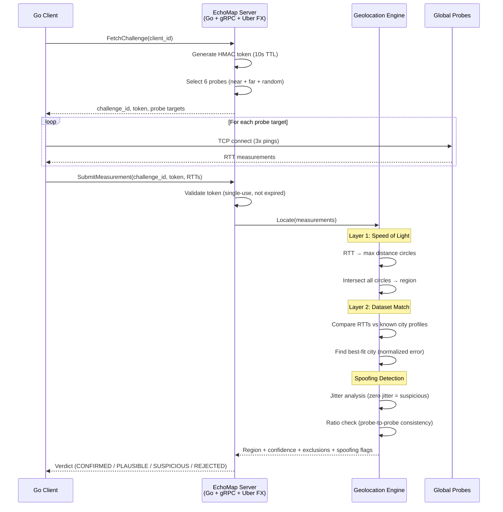
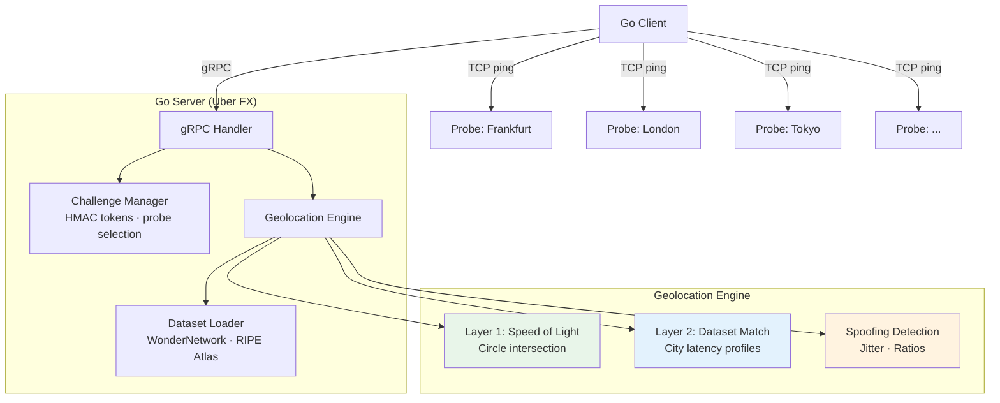

# EchoMap

**Latency-based geolocation using the speed of light as a hard constraint.**

EchoMap determines where a user physically is (and isn't) by measuring network round-trip times to globally distributed probes. It uses two layers of proof:

1. **Hard bound (physics):** Light in fiber travels ~200 km/ms. An RTT gives an absolute maximum distance from a probe. You can't fake being faster than light.
2. **Soft bound (datasets):** Known city-to-city latency data tightens the estimate by matching observed RTTs against real-world network profiles.

## How It Works



## The Core Math

```
max_distance_km = (rtt_ms / 2) × 200

Example with 3 probes:
  RTT to Frankfurt: 12ms  →  max 1,200 km from Frankfurt
  RTT to London:     8ms  →  max   800 km from London
  RTT to Paris:      6ms  →  max   600 km from Paris

  Circle intersection → user is in northern France / Benelux
```

Spoofing only **adds** latency (bigger circles, less precision) — it can never place you somewhere you aren't.

## Architecture



## Real-World Results

Running from the **Pacific Northwest, US** against 16 probes across 6 continents:

```
=== GEOLOCATION RESULT ===
  Verdict:    STATUS_CONFIRMED
  Location:   Seattle, US (47.65°N, 122.33°W)
  Accuracy:   ±508 km radius

  Confidence:
    Physics (speed of light):    90.0%
    Physics + network latency:   95.0%
    Nearest probe:              sea-1

  Network Latency Match (Layer 2):
    Best match city:  Los Angeles
    Match quality:    58.0%

  Probe Details:
  PROBE           RTT   EXPECTED    MAX DIST  BOUND
  jnb-1       318.1ms   213.6ms     30808 km   within 30808 km
  sel-1       174.6ms   124.8ms     16464 km   within 16464 km
  sin-1       171.4ms   181.4ms     16143 km   within 16143 km
  ord-1        48.0ms    40.3ms      3805 km   within 3805 km
  ewr-1        66.5ms    54.4ms      5655 km   within 5655 km
  sea-1         5.0ms    18.5ms       503 km   within 503 km
  lon-1       176.3ms   114.7ms     16628 km   within 16628 km

  Performance:
    Total time:        999ms
    Challenge fetch:   10ms (1 gRPC call)
    Probe pings:       965ms (16 probes × 3 pings = 48 TCP connects, parallel)
    Submit + compute:  22ms (1 gRPC call)
    Total requests:    50 (2 gRPC + 48 TCP)
```

### How Confidence Works

| Layer | What It Proves | Range |
|-------|---------------|-------|
| **Physics (speed of light)** — 90% | Max distance from each probe based on RTT. Cannot be faked — you can't be faster than light in fiber. | Nearest probe (sea-1 at 5ms) anchors within ~500 km |
| **Physics + network latency** — 95% | Cross-references observed RTTs against 225 known city-to-city latency pairs. Boosts confidence when the profile matches a real city. | Adds 5% here: observed RTTs broadly match US West Coast profile |

The **EXPECTED** column shows what the dataset predicts the RTT *should* be for the best-match city. Comparing expected vs observed reveals:
- **Close match** (Singapore: 171ms observed vs 181ms expected) — consistent with the matched region
- **Higher than expected** (London: 176ms observed vs 115ms expected) — normal variance from TCP overhead and routing
- **Nearest probe** (Seattle: 5ms observed vs 18ms expected) — user is closer than any city in the dataset, confirming proximity

### What The Numbers Mean

- **±508 km radius**: You are somewhere within a ~500 km circle centered on the estimated location
- **5.0ms to Seattle probe**: After subtracting ~10ms TCP overhead, this means you're within ~503 km of Seattle's Vultr datacenter
- **48 TCP connects in 965ms**: All probes pinged in parallel — total time is the slowest probe (Johannesburg at ~318ms x 3 pings), not the sum
- **2 gRPC calls + 22ms compute**: One to fetch the challenge (HMAC token), one to submit measurements. Server computes geolocation in <1ms
- **50 total requests**: 2 gRPC + 48 TCP — the entire geolocation check in under 1 second

## Quick Start

### Prerequisites

- Go 1.21+
- protoc + protoc-gen-go + protoc-gen-go-grpc (for proto regeneration only)

### Build & Run

```bash
# Build
make build

# Start server (default :50051)
make server

# In another terminal — run client
make client

# Run tests
make test
```

### Configuration (env vars)

| Variable | Default | Description |
|----------|---------|-------------|
| `ECHOMAP_GRPC_PORT` | `50051` | gRPC listen port |
| `ECHOMAP_TOKEN_TTL` | `10s` | Challenge token time-to-live |
| `ECHOMAP_PROBE_COUNT` | `6` | Number of probes per challenge |
| `ECHOMAP_PING_COUNT` | `3` | Pings per probe |
| `ECHOMAP_TIMEOUT_MS` | `5000` | Client timeout for all pings |
| `ECHOMAP_HMAC_SECRET` | (dev default) | HMAC signing key (set in production!) |
| `ECHOMAP_DB_PATH` | `echomap.db` | SQLite database path |
| `ECHOMAP_RATE_LIMIT_MAX` | `10` | Max requests per window per client |
| `ECHOMAP_RATE_LIMIT_WINDOW` | `1m` | Rate limit window duration |
| `ECHOMAP_DATASET_PATH` | (none) | Path to WonderNetwork CSV for soft bounds |
| `ECHOMAP_RIPE_MEASUREMENTS` | (none) | Comma-separated RIPE Atlas measurement IDs to fetch at startup |

## Project Structure

```
echomap/
├── cmd/
│   ├── echomap/           # Server binary (Uber FX)
│   └── echomap-client/    # CLI client
├── proto/v1/              # Protobuf definition + generated stubs
├── internal/
│   ├── config/            # Env-based configuration
│   ├── challenge/         # HMAC tokens, probe selection
│   ├── dataset/           # Latency dataset parser + matcher
│   ├── geo/               # Haversine, circles, intersection, engine
│   ├── grpcserver/        # gRPC handlers
│   ├── ratelimit/         # Sliding window rate limiter + gRPC interceptor
│   └── storage/           # SQLite persistence (results, anomalies, history)
├── Makefile
└── ERD.md                 # Full PRD / design document
```

## Why Spoofing Doesn't Help

| Attack | What Happens | Result |
|--------|-------------|--------|
| **VPN/Proxy** | Adds latency → bigger circles | Region gets vaguer, never wrong |
| **Artificial delay** | Same as VPN | Can't prove location, only that you're NOT far away |
| **Replay** | Stale token | Rejected — tokens are single-use, 10s TTL |
| **Claim wrong city** | RTT ratios don't match | Flagged as `SUSPICIOUS` by dataset matching |

## Challenge Token Security

Every geolocation check is bound to a **single-use, time-limited HMAC token**:

```
Client                          Server
  │                               │
  ├── FetchChallenge(client_id) ──►│  Server generates:
  │                               │    - Random challenge_id
  │                               │    - HMAC token = sign(challenge_id + client_id + expiry)
  │◄── challenge_id + token ──────│    - Stores token, sets 10s TTL
  │                               │
  │  (client pings probes)        │
  │                               │
  ├── SubmitMeasurement ──────────►│  Server validates:
  │   challenge_id + token        │    1. Challenge ID exists?     → reject if unknown
  │   + RTT measurements          │    2. Token matches HMAC?      → reject if tampered
  │                               │    3. Token expired (>10s)?    → reject if stale
  │                               │    4. Token already used?      → reject (single-use)
  │                               │    5. Delete token (consumed)
  │◄── verdict ───────────────────│
```

**What this prevents:**

| Attack | How Token Stops It |
|--------|-------------------|
| **Replay** | Tokens are consumed on first use — same measurements can't be submitted twice |
| **Pre-computation** | Tokens expire in 10s — can't pre-measure and submit later |
| **Token sharing** | HMAC binds token to specific challenge_id — can't reuse across sessions |
| **Token forgery** | HMAC requires server secret — can't generate valid tokens client-side |
| **Brute force** | Rate limiter: 10 challenges/minute per client |

Tested with 8 dedicated token security tests: unknown challenge, tampered token, swapped tokens between sessions, double-submit replay, empty client ID, expiry bounds, and probe target validation.

## Latency Datasets

### Free (built-in, no signup required)

| Dataset | How EchoMap Uses It | Limits |
|---------|-------------------|--------|
| [RIPE Atlas](https://atlas.ripe.net/) | Built-in adapter fetches historical ping data from 12,000+ global probes. Set `ECHOMAP_RIPE_MEASUREMENTS` to a comma-separated list of measurement IDs. | 300 req/s, no auth needed |
| [Globalping](https://www.globalping.io/) | Built-in adapter runs live pings from 800+ probes for real-time cross-validation. Works out of the box. | 250 tests/hr, no auth needed |

```bash
# Use RIPE Atlas historical data (free, no signup)
ECHOMAP_RIPE_MEASUREMENTS=1001,1002,1003 make server

# Globalping is used automatically for live cross-validation
```

### Optional (requires download or account)

| Dataset | Setup | Notes |
|---------|-------|-------|
| [WonderNetwork](https://wondernetwork.com/pings) | Download CSV manually, set `ECHOMAP_DATASET_PATH=./data/pings.csv` | Free historical snapshot from 2020. Monthly updates require paid account. "Please don't scrape." |
| [CAIDA Ark](https://www.caida.org/catalog/datasets/ark-ipv4/) | Download `.warts` files, convert with `sc_warts2json` | Traceroute topology, not ping latency. Academic/research focus. Recent IPv4 data is restricted. |

## Tests

111 tests across 9 modules, all built test-first (TDD):

```
internal/geo               — 36 tests (Haversine, circles, jitter CV, VPN, correlation, dataset, fallback, 0-0 guard)
internal/grpcserver        — 20 tests (handlers, token security, replay, spoofing, integration: storage, rate limit, VPN)
internal/challenge         — 12 tests (tokens, expiry, single-use, diversity-based probe selection)
internal/dataset           — 10 tests (CSV parsing, lookup, best-match, region filtering)
internal/storage           —  8 tests (SQLite CRUD, client history, anomaly logs, suspicious count)
internal/ratelimit         —  7 tests (sliding window, per-client isolation, gRPC interceptor)
internal/dataset/ripeatlas —  4 tests (RIPE Atlas API parsing, probe coords, dataset building)
internal/dataset/globalping—  4 tests (Globalping API, probe results, end-to-end ping)
internal/config            —  4 tests (defaults, env overrides, invalid input)
```

## License

This project is licensed under the [PolyForm Noncommercial License 1.0.0](LICENSE).

**You can:** view, fork, learn from, run personally, use for research/education.

**You cannot:** use commercially without permission.

Interested in commercial use? Contact [Alex Ibarra](https://github.com/ibarrajo).
